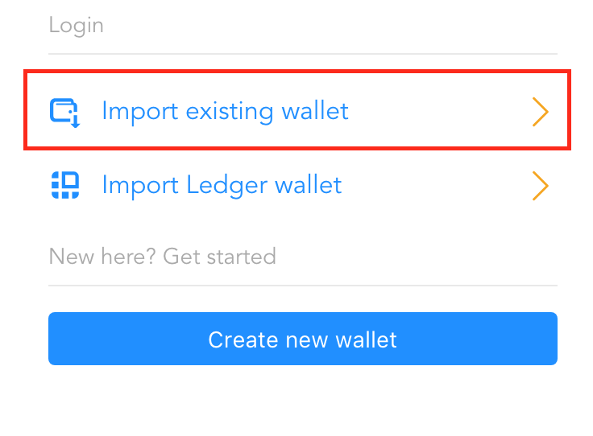
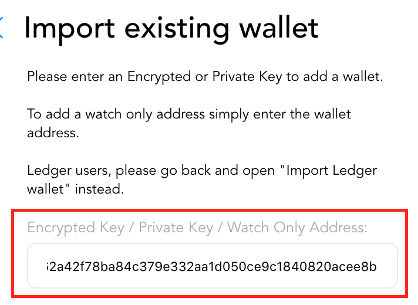
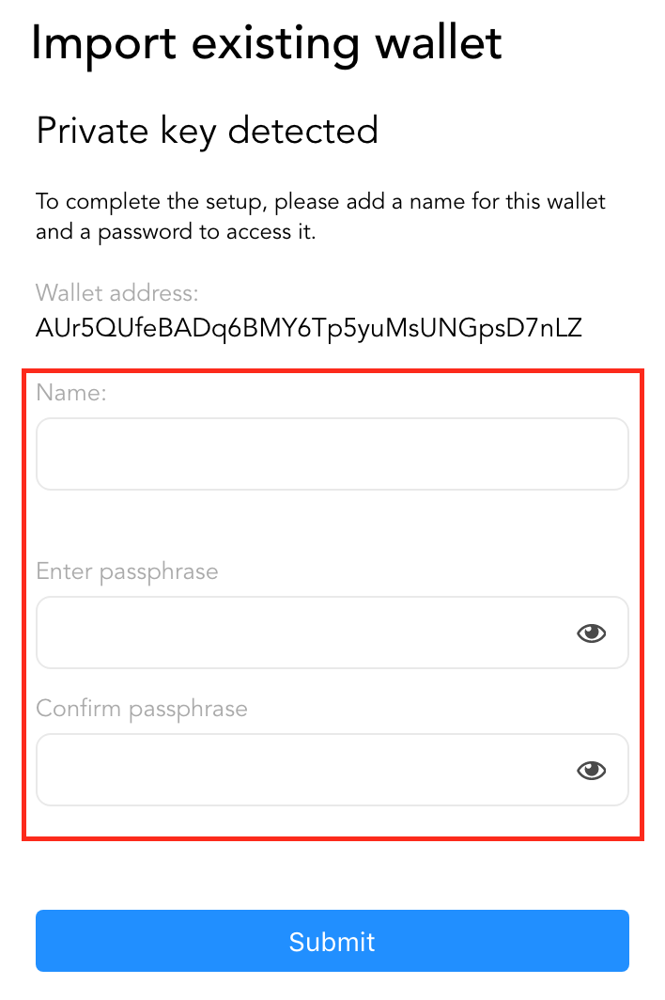
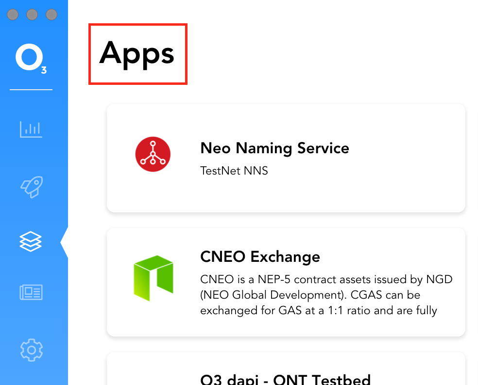
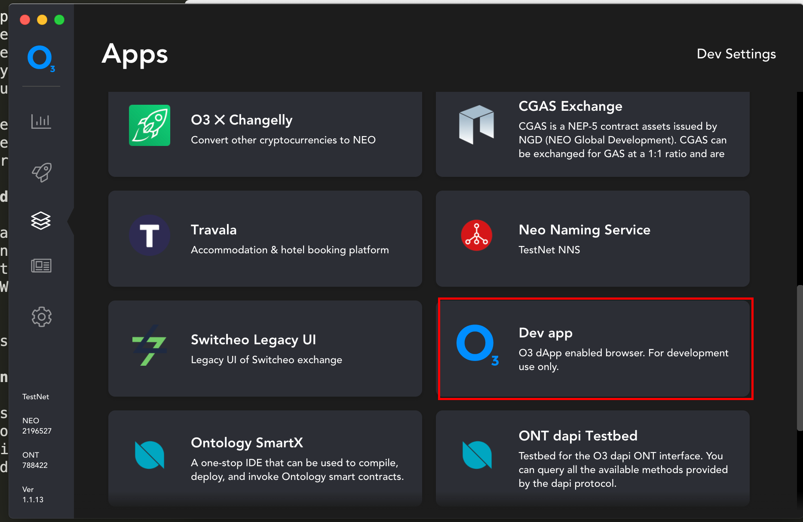

# Development Environment
This is a walkthrough of how to get setup in order to interact with O3 API's connecting to the NEO blockchain.

## O3 App Installation
Download and install the latest version of the latest versions of the O3 apps.


[O3 Desktop Installer](https://o3.network/)
Be sure to install the desktop version of the O3 application for development. Mobile support coming soon.


## O3 Setup

Open up the O3 app, and click the "Import existing wallet" button, or create a new wallet if you do not already have one.





Give the account a name, and a password to login to this account in the future.



You should now be logged into a wallet in O3. Please navigate to the apps screen by clicking on the apps icon in the toolbar on the left hand side.


Once on the apps screen, click on the title "Apps" rapidly 10 times to put the O3 app into developer mode.



You should notice that in dev mode you will now have access to the "Dev Settings" menu on the top right, and the addition of several developer apps to the app list.


## Testing the O3 API's (O3 dapi Testbed)

To get your feet wet, we provide a testbed that will let you interact with all the O3 API's


Now that your contract is deployed to your private net, we want to call it. When calling your contract in your dapp, you can use the O3 dapi with the Ontology plugin. To guide you in doing so, the O3 app in dev mode provides a app called "NEO dapi Testbed".


Once open, you can test all the methods listed in this documentation in a sandboxed environment.


For example, getProvider will give you information about the O3 wallet in a structured JSON format. Feel free to test out all of these methods to see how the User Flow will work on various methods. Some methods, like sending will require additonal user authentication from the wallet.


## Connecting to your own website

After testing out the methods in the testbed, you will likely want to connect to your own website. Navigate to the O3 Dev app in order to connect to your own custom URL.



From here that you can test out your application with the O3 Wallet. Just install the inject the latest o3-dapi package located here for an easy way to access all dapi methods using javascript.

[NEO dapi](https://github.com/O3Labs/o3-dapi/tree/master/packages/neo)

# Getting Started w/ Development

The o3-dapi requires 2 packages to operate, `o3-dapi-core` and `o3-dapi-neo`.

You can install via CDN in a browser application or via NPM for bundled apps.

## In a browser - cdn

```html
<script src="https://cdn.jsdelivr.net/npm/o3-dapi-core/lib/o3-dapi-core.min.js"></script>
<script src="https://cdn.jsdelivr.net/npm/o3-dapi-neo/lib/o3-dapi-neo.min.js"></script>
```
```typescript
window.o3dapi
window.o3dapiNeo
```

o3-dapi-core [](https://www.jsdelivr.com/package/npm/o3-dapi-core)

o3-dapi-neo [](https://www.jsdelivr.com/package/npm/o3-dapi-neo)


## Install via npm

```typescript
npm i --save o3-dapi-core o3-dapi-neo

or

yarn add o3-dapi-core o3-dapi-neo
```

```typescript
var o3dapi = require('o3-dapi-core');
var o3dapiNeo = require('o3-dapi-neo');

or

import o3dapi from 'o3-dapi-core';
import o3dapiNeo from 'o3-dapi-neo';
```

o3-dapi-core [](https://badge.fury.io/js/o3-dapi-neo)

o3-dapi-neo [](https://badge.fury.io/js/o3-dapi-core)


## Example
```typescript
import o3dapi from 'o3-dapi-core';
import o3dapiNeo from 'o3-dapi-neo';

// Init the NEO plugin into the core dapi provider package
o3dapi.initPlugins([o3dapiNeo]);


o3dapi.NEO.getNetworks()
.then(networks => console.log(networks));
```
